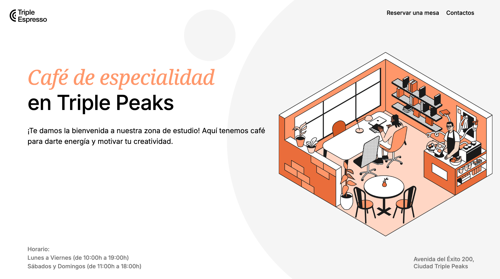

# 👨‍💻 Gerardo Rangel | Full-Stack Web Developer

## 🚀 Sobre mí

Soy Ingeniero Industrial y desarrollador **Full-Stack Web Developer en formación**.

Me apasiona crear experiencias web modernas, funcionales y accesibles.
Actualmente estoy desarrollando mis habilidades en tecnologías frontend y aplicando buenas prácticas de desarrollo como estructura semántica HTML, metodología BEM y diseño responsive.

Me gusta resolver problemas mediante el código y aprender nuevas tecnologías que me permitan crear soluciones de calidad.

---

## 🛠️ Tecnologías

### Frontend

- HTML5
- CSS3
- JavaScript
- Diseño Responsive
- Metodología BEM

### Herramientas

- Git
- GitHub
- Visual Studio Code
- Prettier

---

## 📂 Proyectos

### ☕ Triple Espresso

Sitio web responsive para una cafetería de especialidad.

Incluye:
- Maquetación con HTML semántico
- Estilos con CSS
- Diseño adaptable a diferentes dispositivos

Tecnologías:

`HTML` `CSS`

---

### 💼 Portafolio Personal

Mi sitio web personal donde muestro mis habilidades, proyectos y experiencia como desarrollador web.

Tecnologías:

`HTML` `CSS` `JavaScript`

---

## 📸 Vista previa

---

## 📬 Contacto

¿Tienes algún proyecto o oportunidad?

Puedes contactarme:

📧 **gerardoanrg@gmail.com**

💻 GitHub:
https://github.com/MqgiaG

---

⭐ Gracias por visitar mi portafolio.
